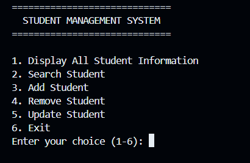

# Student-Management-System

A simple Student Management System built with Java to practice Object-Oriented Programming (OOP).

## Features
- View Students Information
- Create Student
- Delete Student
- Search Student
- Change Student Information

## Technologies
- Java
- OOP
- Scanner

## Project Structure

- **MainConsole.java** - Handles user interaction and menu navigation.
- **StudentManager.java** - Manages student records and including adding, searching, updating, removing, and displaying student.
- **Student.java** - Represents a student and stores student information.

# How to Run

1. Clone this repository or dowload it as a ZIP file.
2. Open the project in any Java IDE (e.g. VS Code or IntelliJ IDEA).
3. Make sure JDK 17 or above is installed.
4. Run 'MainConsole.java' in src folder.
5. Follow the menu displayed in the console

## Learning Objective

- Practice Java OOP
- Understand the process of developing a project
- Learn Git and GitHub Workflow

## Future improvements

- Input validation

